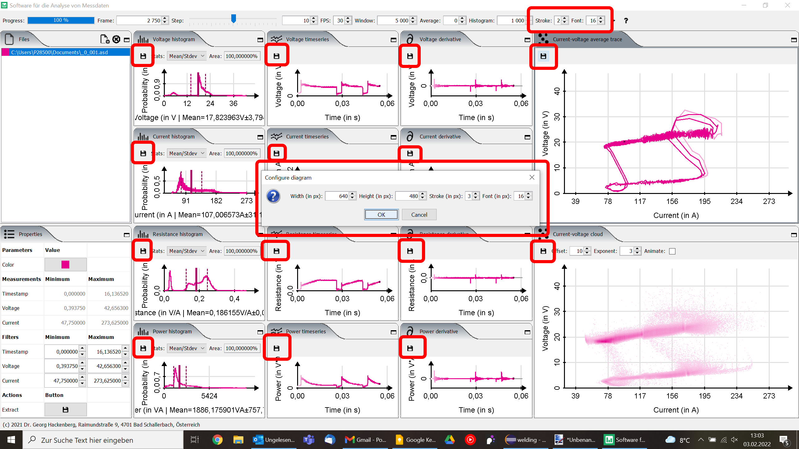

# Welding Analytics

**Tool for the analytics and visualization of welding process data.** The graphical user interface is implemented using Swing. The chart visualization are custom-made (no JFreeChart dependency or alike).

